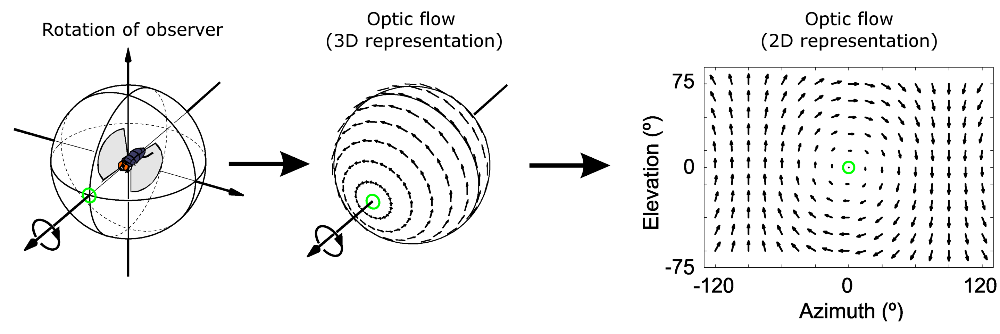
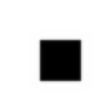
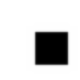
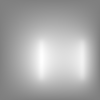
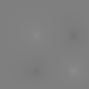

# Optical Flow Algorithm Implementation Using Horn-Schunck Method

## Introduction
Optical flow is a critical concept in computer vision, describing the motion of objects across a sequence of images. It quantifies displacement as a vector field where each vector represents the movement of points from one frame to the next. This repository contains a C++ implementation of the Horn-Schunck algorithm, which is used to compute optical flow by minimizing a global energy functional, leading to a solution of a system of partial differential equations.

### Applications
Optical flow has applications in:
- Video compression
- Object tracking
- Autonomous driving
- Robotics

## Algorithm Overview
The Horn-Schunck algorithm focuses on minimizing an energy function which can be described by a set of partial differential equations. A finite difference discretization approach is used for practical computation.

### Steps:
1. **Read image sequence:** Utilizes the CImg library to load image data.
2. **Compute image derivatives:** Combines images into a 3D structure to compute gradients.
3. **Construct matrices A and b:** Forms part of a linear equation system from the discrete versions of the partial differential equations.
4. **Solve the linear system:** Uses the Eigen library to solve for the optical flow vectors.
5. **Extract and process the flow vectors (u, v):** Retrieves the flow vectors from the solution and processes them (normalization and quantization).

## Getting Started

### Prerequisites
- C++ compiler
- CImg library for image processing
- Eigen library for solving linear algebra problems

### Installation
1. Clone the repository:
git clone Optical-Flow-Horn-Schunck

2. Ensure the CImg and Eigen libraries are included in your project or install them:
sudo apt-get install cimg-dev
sudo apt-get install libeigen3-dev

### Usage
To run the program:
cd [project-directory]
g++ -o optical_flow main.cpp -lX11 -lpthread
./optical_flow

## Example Output
Below are examples of optical flow vectors `u` and `v` computed from a given image sequence:

**Image 1:** 

**Image 2:** 

**Vector Field u:** 

**Vector Field v:** 

## Contributing
Contributions to enhance or extend the functionality are welcome. Please fork the repository and submit a pull request.

